# 🏗️ **ISS - ARCHITETTURA TECNICA DETTAGLIATA**

## 🎯 **OVERVIEW SISTEMA COMPLETO**

```mermaid
graph TB
    subgraph "🌐 Frontend Layer"
        A[React 19 + TypeScript]
        B[TanStack Router]
        C[Tailwind + ISS Design]
        D[React Query + Zustand]
    end
    
    subgraph "🔄 API Gateway"
        E[Nginx Reverse Proxy]
        F[Rate Limiting]
        G[CORS + Security]
    end
    
    subgraph "🚀 Backend Services"
        H[FastAPI Main App]
        I[Authentication Service]
        J[Bando Monitor Service]
        K[Email Service]
        L[Payment Service]
    end
    
    subgraph "🗄️ Data Layer"
        M[PostgreSQL 16]
        N[Redis Cache]
        O[File Storage]
    end
    
    subgraph "🔌 External APIs"
        P[SendGrid Email]
        Q[Telegram Bot]
        R[Google Calendar]
        S[Accessibility APIs]
        T[Translation APIs]
    end
    
    A --> E
    E --> H
    H --> M
    H --> N
    H --> P
    H --> Q
    H --> R
    H --> S
    H --> T
```



---

## 📊 **DATABASE SCHEMA COMPLETO**

### **🗄️ Struttura Database PostgreSQL**

```sql
-- =====================================
-- USERS & AUTHENTICATION
-- =====================================

CREATE TABLE users (
    id UUID PRIMARY KEY DEFAULT gen_random_uuid(),
    email VARCHAR(255) UNIQUE NOT NULL,
    hashed_password VARCHAR(255) NOT NULL,
    full_name VARCHAR(255) NOT NULL,
    user_type ENUM('cittadino', 'aps', 'admin') NOT NULL,
    is_active BOOLEAN DEFAULT TRUE,
    is_verified BOOLEAN DEFAULT FALSE,
    verification_token VARCHAR(255),
    reset_token VARCHAR(255),
    reset_token_expires TIMESTAMP,
    profile_data JSONB, -- Dati specifici per tipo utente
    preferences JSONB, -- Notifiche, privacy, ecc.
    created_at TIMESTAMP DEFAULT CURRENT_TIMESTAMP,
    updated_at TIMESTAMP DEFAULT CURRENT_TIMESTAMP,
    last_login TIMESTAMP
);

CREATE TABLE user_sessions (
    id UUID PRIMARY KEY DEFAULT gen_random_uuid(),
    user_id UUID REFERENCES users(id) ON DELETE CASCADE,
    token_hash VARCHAR(255) NOT NULL,
    device_info JSONB,
    ip_address INET,
    expires_at TIMESTAMP NOT NULL,
    created_at TIMESTAMP DEFAULT CURRENT_TIMESTAMP
);

-- =====================================
-- SISTEMA BANDI (ESISTENTE + ENHANCED)
-- =====================================

CREATE TABLE bandi (
    id UUID PRIMARY KEY DEFAULT gen_random_uuid(),
    titolo VARCHAR(500) NOT NULL,
    descrizione TEXT,
    ente_erogatore VARCHAR(255) NOT NULL,
    fonte ENUM('comune_salerno', 'regione_campania', 'csv_salerno', 'fondazione_comunita') NOT NULL,
    categoria VARCHAR(100),
    importo_max DECIMAL(12,2),
    data_scadenza DATE,
    data_pubblicazione DATE,
    link_bando VARCHAR(500),
    requirements TEXT[],
    tags VARCHAR(50)[],
    status ENUM('attivo', 'scaduto', 'archiviato') DEFAULT 'attivo',
    priority_score INTEGER DEFAULT 0,
    applicants_count INTEGER DEFAULT 0,
    success_rate DECIMAL(5,2),
    created_at TIMESTAMP DEFAULT CURRENT_TIMESTAMP,
    updated_at TIMESTAMP DEFAULT CURRENT_TIMESTAMP
);

CREATE TABLE user_saved_bandi (
    user_id UUID REFERENCES users(id) ON DELETE CASCADE,
    bando_id UUID REFERENCES bandi(id) ON DELETE CASCADE,
    notes TEXT,
    application_status ENUM('interested', 'applied', 'approved', 'rejected'),
    saved_at TIMESTAMP DEFAULT CURRENT_TIMESTAMP,
    PRIMARY KEY (user_id, bando_id)
);

-- =====================================
-- CORSI FORMAZIONE ISS
-- =====================================

CREATE TABLE corsi (
    id UUID PRIMARY KEY DEFAULT gen_random_uuid(),
    titolo VARCHAR(255) NOT NULL,
    descrizione TEXT NOT NULL,
    categoria ENUM('alfabetizzazione', 'professionale', 'assistive', 'avanzato') NOT NULL,
    livello ENUM('base', 'intermedio', 'avanzato') NOT NULL,
    durata_ore INTEGER NOT NULL,
    costo_organizzativo DECIMAL(8,2) DEFAULT 0, -- Solo per budget interno, sempre gratuito per utenti
    max_partecipanti INTEGER DEFAULT 20,
    modalita ENUM('presenza', 'online', 'misto') NOT NULL,
    certificazione BOOLEAN DEFAULT FALSE,
    requisiti TEXT[],
    programma_dettagliato JSONB,
    instructor_id UUID REFERENCES users(id),
    image_url VARCHAR(500),
    status ENUM('draft', 'published', 'full', 'completed', 'cancelled') DEFAULT 'draft',
    created_at TIMESTAMP DEFAULT CURRENT_TIMESTAMP,
    updated_at TIMESTAMP DEFAULT CURRENT_TIMESTAMP
);

CREATE TABLE corso_sessions (
    id UUID PRIMARY KEY DEFAULT gen_random_uuid(),
    corso_id UUID REFERENCES corsi(id) ON DELETE CASCADE,
    data_inizio DATE NOT NULL,
    data_fine DATE NOT NULL,
    orario_inizio TIME NOT NULL,
    orario_fine TIME NOT NULL,
    location VARCHAR(255),
    zoom_link VARCHAR(500),
    max_partecipanti INTEGER,
    current_partecipanti INTEGER DEFAULT 0,
    status ENUM('scheduled', 'ongoing', 'completed', 'cancelled') DEFAULT 'scheduled'
);

CREATE TABLE corso_iscrizioni (
    id UUID PRIMARY KEY DEFAULT gen_random_uuid(),
    user_id UUID REFERENCES users(id) ON DELETE CASCADE,
    session_id UUID REFERENCES corso_sessions(id) ON DELETE CASCADE,
    registration_status ENUM('registered', 'confirmed', 'completed') DEFAULT 'registered',
    accessibility_needs JSONB, -- Esigenze accessibilità specifiche
    enrollment_date TIMESTAMP DEFAULT CURRENT_TIMESTAMP,
    completion_date TIMESTAMP,
    certificate_url VARCHAR(500),
    progress JSONB, -- Track progress per lezione
    rating INTEGER CHECK (rating >= 1 AND rating <= 5),
    review TEXT,
    UNIQUE(user_id, session_id)
);

-- =====================================
-- EVENTI & WORKSHOP
-- =====================================

CREATE TABLE eventi (
    id UUID PRIMARY KEY DEFAULT gen_random_uuid(),
    titolo VARCHAR(255) NOT NULL,
    descrizione TEXT NOT NULL,
    tipo ENUM('hackathon', 'workshop', 'conferenza', 'laboratorio', 'networking') NOT NULL,
    data_evento TIMESTAMP NOT NULL,
    durata_minuti INTEGER NOT NULL,
    location VARCHAR(255),
    online_link VARCHAR(500),
    accessibility_info JSONB, -- Info accessibilità sede/evento
    max_partecipanti INTEGER,
    costo_organizzativo DECIMAL(8,2) DEFAULT 0, -- Solo per budget interno
    organizer_id UUID REFERENCES users(id),
    image_url VARCHAR(500),
    agenda JSONB, -- Programma dettagliato
    speakers JSONB[], -- Array di speaker info
    sponsors JSONB[], -- Sponsor information
    status ENUM('draft', 'published', 'full', 'ongoing', 'completed', 'cancelled') DEFAULT 'draft',
    registration_deadline TIMESTAMP,
    created_at TIMESTAMP DEFAULT CURRENT_TIMESTAMP,
    updated_at TIMESTAMP DEFAULT CURRENT_TIMESTAMP
);

CREATE TABLE evento_registrations (
    id UUID PRIMARY KEY DEFAULT gen_random_uuid(),
    user_id UUID REFERENCES users(id) ON DELETE CASCADE,
    evento_id UUID REFERENCES eventi(id) ON DELETE CASCADE,
    registration_date TIMESTAMP DEFAULT CURRENT_TIMESTAMP,
    attendance_status ENUM('registered', 'confirmed', 'attended', 'no_show') DEFAULT 'registered',
    check_in_time TIMESTAMP,
    accessibility_needs JSONB, -- Esigenze specifiche accessibilità
    dietary_requirements TEXT, -- Eventuali esigenze alimentari per catering
    transport_needs TEXT, -- Necessità trasporto/accompagnamento
    feedback JSONB, -- Post-evento feedback
    UNIQUE(user_id, evento_id)
);

-- =====================================
-- PROGETTI ISS
-- =====================================

CREATE TABLE progetti (
    id UUID PRIMARY KEY DEFAULT gen_random_uuid(),
    titolo VARCHAR(255) NOT NULL,
    descrizione TEXT NOT NULL,
    obiettivi TEXT[] NOT NULL,
    categoria VARCHAR(100) NOT NULL,
    status ENUM('pianificazione', 'attivo', 'completato', 'sospeso') DEFAULT 'pianificazione',
    data_inizio DATE,
    data_fine_prevista DATE,
    data_fine_effettiva DATE,
    budget_totale DECIMAL(12,2),
    budget_utilizzato DECIMAL(12,2) DEFAULT 0,
    project_manager_id UUID REFERENCES users(id),
    partner_organizations JSONB[],
    deliverables JSONB[],
    kpi_metrics JSONB,
    impact_report JSONB,
    visibility ENUM('public', 'partners', 'private') DEFAULT 'public',
    created_at TIMESTAMP DEFAULT CURRENT_TIMESTAMP,
    updated_at TIMESTAMP DEFAULT CURRENT_TIMESTAMP
);

CREATE TABLE progetto_team_members (
    progetto_id UUID REFERENCES progetti(id) ON DELETE CASCADE,
    user_id UUID REFERENCES users(id) ON DELETE CASCADE,
    ruolo VARCHAR(100) NOT NULL,
    responsabilita TEXT[],
    joined_date DATE DEFAULT CURRENT_DATE,
    left_date DATE,
    is_active BOOLEAN DEFAULT TRUE,
    PRIMARY KEY (progetto_id, user_id)
);

-- =====================================
-- VOLONTARIATO
-- =====================================

CREATE TABLE volunteer_opportunities (
    id UUID PRIMARY KEY DEFAULT gen_random_uuid(),
    titolo VARCHAR(255) NOT NULL,
    descrizione TEXT NOT NULL,
    competenze_richieste VARCHAR(100)[],
    tempo_richiesto VARCHAR(100), -- "2 ore/settimana", "weekend", etc.
    modalita ENUM('presenza', 'remoto', 'misto') NOT NULL,
    categoria VARCHAR(100) NOT NULL,
    urgenza ENUM('bassa', 'media', 'alta') DEFAULT 'media',
    data_inizio DATE,
    data_fine DATE,
    max_volontari INTEGER DEFAULT 1,
    current_volontari INTEGER DEFAULT 0,
    contact_person_id UUID REFERENCES users(id),
    status ENUM('open', 'full', 'ongoing', 'completed', 'cancelled') DEFAULT 'open',
    created_at TIMESTAMP DEFAULT CURRENT_TIMESTAMP
);

CREATE TABLE volunteer_applications (
    id UUID PRIMARY KEY DEFAULT gen_random_uuid(),
    opportunity_id UUID REFERENCES volunteer_opportunities(id) ON DELETE CASCADE,
    user_id UUID REFERENCES users(id) ON DELETE CASCADE,
    motivation TEXT NOT NULL,
    available_time VARCHAR(200),
    relevant_experience TEXT,
    status ENUM('pending', 'approved', 'rejected', 'withdrawn') DEFAULT 'pending',
    applied_date TIMESTAMP DEFAULT CURRENT_TIMESTAMP,
    reviewed_date TIMESTAMP,
    reviewer_notes TEXT,
    start_date DATE,
    end_date DATE,
    hours_completed INTEGER DEFAULT 0,
    performance_rating INTEGER CHECK (performance_rating >= 1 AND performance_rating <= 5),
    UNIQUE(opportunity_id, user_id)
);

-- =====================================
-- BLOG & NEWS
-- =====================================

CREATE TABLE news_posts (
    id UUID PRIMARY KEY DEFAULT gen_random_uuid(),
    titolo VARCHAR(255) NOT NULL,
    slug VARCHAR(255) UNIQUE NOT NULL,
    contenuto TEXT NOT NULL,
    excerpt TEXT,
    featured_image VARCHAR(500),
    author_id UUID REFERENCES users(id) NOT NULL,
    categoria VARCHAR(100) NOT NULL,
    tags VARCHAR(50)[],
    status ENUM('draft', 'published', 'archived') DEFAULT 'draft',
    published_at TIMESTAMP,
    views_count INTEGER DEFAULT 0,
    likes_count INTEGER DEFAULT 0,
    seo_title VARCHAR(255),
    seo_description TEXT,
    created_at TIMESTAMP DEFAULT CURRENT_TIMESTAMP,
    updated_at TIMESTAMP DEFAULT CURRENT_TIMESTAMP
);

-- =====================================
-- TESTIMONIALS & REVIEWS
-- =====================================

CREATE TABLE testimonials (
    id UUID PRIMARY KEY DEFAULT gen_random_uuid(),
    user_id UUID REFERENCES users(id) ON DELETE CASCADE,
    tipo ENUM('corso', 'evento', 'progetto', 'generale') NOT NULL,
    entity_id UUID, -- ID del corso/evento/progetto
    rating INTEGER CHECK (rating >= 1 AND rating <= 5) NOT NULL,
    titolo VARCHAR(255),
    contenuto TEXT NOT NULL,
    is_featured BOOLEAN DEFAULT FALSE,
    is_approved BOOLEAN DEFAULT FALSE,
    approved_by UUID REFERENCES users(id),
    created_at TIMESTAMP DEFAULT CURRENT_TIMESTAMP
);

-- =====================================
-- SYSTEM & ANALYTICS
-- =====================================

CREATE TABLE user_analytics (
    id UUID PRIMARY KEY DEFAULT gen_random_uuid(),
    user_id UUID REFERENCES users(id) ON DELETE CASCADE,
    session_id VARCHAR(255),
    event_type VARCHAR(100) NOT NULL,
    event_data JSONB,
    page_path VARCHAR(500),
    user_agent TEXT,
    ip_address INET,
    timestamp TIMESTAMP DEFAULT CURRENT_TIMESTAMP
);

CREATE TABLE system_logs (
    id BIGSERIAL PRIMARY KEY,
    level VARCHAR(20) NOT NULL,
    message TEXT NOT NULL,
    module VARCHAR(100),
    user_id UUID REFERENCES users(id),
    metadata JSONB,
    timestamp TIMESTAMP DEFAULT CURRENT_TIMESTAMP
);

-- =====================================
-- NOTIFICATIONS
-- =====================================

CREATE TABLE notifications (
    id UUID PRIMARY KEY DEFAULT gen_random_uuid(),
    user_id UUID REFERENCES users(id) ON DELETE CASCADE,
    tipo ENUM('email', 'sms', 'push', 'in_app') NOT NULL,
    channel ENUM('bandi', 'corsi', 'eventi', 'progetti', 'sistema') NOT NULL,
    titolo VARCHAR(255) NOT NULL,
    contenuto TEXT NOT NULL,
    data JSONB, -- Dati aggiuntivi per rendering
    status ENUM('pending', 'sent', 'delivered', 'failed', 'read') DEFAULT 'pending',
    scheduled_for TIMESTAMP DEFAULT CURRENT_TIMESTAMP,
    sent_at TIMESTAMP,
    read_at TIMESTAMP,
    created_at TIMESTAMP DEFAULT CURRENT_TIMESTAMP
);
```

---

## 🔌 **API ENDPOINTS MAPPING**

### **🎯 Endpoints Mancanti da Implementare**

```python
# =====================================
# USER MANAGEMENT
# =====================================
POST   /api/v1/auth/register
POST   /api/v1/auth/login  
POST   /api/v1/auth/logout
POST   /api/v1/auth/refresh
POST   /api/v1/auth/forgot-password
POST   /api/v1/auth/reset-password
POST   /api/v1/auth/verify-email
GET    /api/v1/users/me
PUT    /api/v1/users/me
PUT    /api/v1/users/me/password
GET    /api/v1/users/me/activity

# =====================================  
# CORSI ISS
# =====================================
GET    /api/v1/corsi/                    # Lista corsi con filtri
POST   /api/v1/corsi/                    # Crea corso (admin)
GET    /api/v1/corsi/{id}               # Dettaglio corso
PUT    /api/v1/corsi/{id}               # Aggiorna corso (admin)
DELETE /api/v1/corsi/{id}               # Elimina corso (admin)
GET    /api/v1/corsi/{id}/sessions      # Sessioni corso
POST   /api/v1/corsi/{id}/enroll        # Iscrizione corso
GET    /api/v1/corsi/my-enrollments     # Miei corsi iscritti
PUT    /api/v1/corsi/{id}/progress      # Aggiorna progresso
GET    /api/v1/corsi/{id}/certificate   # Download certificato

# =====================================
# EVENTI & WORKSHOP  
# =====================================
GET    /api/v1/eventi/                  # Lista eventi
POST   /api/v1/eventi/                  # Crea evento (admin)
GET    /api/v1/eventi/{id}              # Dettaglio evento
PUT    /api/v1/eventi/{id}              # Aggiorna evento (admin)
DELETE /api/v1/eventi/{id}              # Elimina evento (admin)
POST   /api/v1/eventi/{id}/register     # Registrazione evento
GET    /api/v1/eventi/my-registrations  # Mie registrazioni
POST   /api/v1/eventi/{id}/check-in     # Check-in evento
PUT    /api/v1/eventi/{id}/feedback     # Feedback evento

# =====================================
# PROGETTI ISS
# =====================================  
GET    /api/v1/progetti/                # Lista progetti pubblici
POST   /api/v1/progetti/                # Crea progetto (admin)
GET    /api/v1/progetti/{id}            # Dettaglio progetto
PUT    /api/v1/progetti/{id}            # Aggiorna progetto
GET    /api/v1/progetti/{id}/team       # Team progetto
POST   /api/v1/progetti/{id}/join       # Unisciti a progetto
GET    /api/v1/progetti/my-projects     # Miei progetti

# =====================================
# VOLONTARIATO
# =====================================
GET    /api/v1/volontariato/            # Lista opportunità
POST   /api/v1/volontariato/            # Crea opportunità (admin)
GET    /api/v1/volontariato/{id}        # Dettaglio opportunità
POST   /api/v1/volontariato/{id}/apply  # Candidatura volontariato
GET    /api/v1/volontariato/my-applications # Mie candidature
PUT    /api/v1/volontariato/{id}/hours  # Track ore volontariato

# =====================================
# NEWS & BLOG
# =====================================
GET    /api/v1/news/                    # Lista news pubbliche
POST   /api/v1/news/                    # Crea news (admin)
GET    /api/v1/news/{slug}              # Dettaglio news
PUT    /api/v1/news/{id}                # Aggiorna news (admin)
DELETE /api/v1/news/{id}                # Elimina news (admin)
POST   /api/v1/news/{id}/like           # Like news

# =====================================
# STATS & ANALYTICS
# =====================================
GET    /api/v1/stats/iss                # Statistiche ISS generali
GET    /api/v1/stats/bandi              # Statistiche bandi (esistente)
GET    /api/v1/stats/corsi              # Statistiche corsi
GET    /api/v1/stats/eventi             # Statistiche eventi
GET    /api/v1/stats/user-activity      # Attività utente

# =====================================
# ADMIN ENDPOINTS
# =====================================
GET    /api/v1/admin/users              # Gestione utenti
GET    /api/v1/admin/analytics          # Analytics avanzate
GET    /api/v1/admin/system-health      # Health system
POST   /api/v1/admin/notifications/send # Invio notifiche
GET    /api/v1/admin/logs               # System logs
```

---

## 🚀 **IMPLEMENTAZIONE STEP-BY-STEP**

### **🎯 Step 1: Database Setup (Giorno 1-2)**

```python
# 1. Creare migrations Alembic
def create_all_migrations():
    # alembic/versions/004_add_users_system.py
    # alembic/versions/005_add_corsi_system.py
    # alembic/versions/006_add_eventi_system.py
    # alembic/versions/007_add_progetti_system.py
    # alembic/versions/008_add_volontariato_system.py
    # alembic/versions/009_add_notifications_system.py
    pass

# 2. Seed data per development
def seed_development_data():
    # Utenti di test con diversi ruoli
    # Corsi di esempio per tutte le categorie  
    # Eventi mensili programmati
    # Progetti in diverse fasi
    # Opportunità volontariato attive
    pass
```

### **🎯 Step 2: Backend Models & CRUD (Giorno 3-5)**

```python
# app/models/ - Tutti i modelli SQLAlchemy
from app.models.user import User, UserSession
from app.models.corso import Corso, CorsoSession, CorsoIscrizione  
from app.models.evento import Evento, EventoRegistration
from app.models.progetto import Progetto, ProgettoTeamMember
from app.models.volunteer import VolunteerOpportunity, VolunteerApplication
from app.models.news import NewsPost
from app.models.testimonial import Testimonial
from app.models.notification import Notification

# app/crud/ - Operazioni database
from app.crud.user import user_crud
from app.crud.corso import corso_crud
from app.crud.evento import evento_crud
# ... etc per ogni modello

# app/schemas/ - Pydantic schemas
from app.schemas.user import UserCreate, UserUpdate, UserResponse
from app.schemas.corso import CorsoCreate, CorsoUpdate, CorsoResponse
# ... etc per ogni modello
```

### **🎯 Step 3: Authentication System (Giorno 6-7)**

```python
# app/auth/ - Sistema autenticazione completo
from app.auth.jwt import create_access_token, verify_token
from app.auth.password import hash_password, verify_password  
from app.auth.permissions import require_permission, RoleChecker
from app.auth.oauth import GoogleOAuth, LinkedInOAuth
from app.auth.two_factor import generate_2fa_code, verify_2fa_code

# Decorators per proteggere endpoints
@router.post("/protected-endpoint")
@require_permission("admin")
async def admin_only_endpoint():
    pass

@router.get("/user-specific")
@require_permission("authenticated")
async def user_endpoint(current_user: User = Depends(get_current_user)):
    pass
```

### **🎯 Step 4: External Services (Giorno 8-10)**

```python
# app/services/external/
from app.services.email_service import EmailService
from app.services.stripe_service import StripeService
from app.services.sms_service import SmsService
from app.services.calendar_service import GoogleCalendarService
from app.services.notification_service import NotificationService

# Configurazione servizi
email_service = EmailService(
    smtp_host="smtp.sendgrid.net",
    api_key=settings.SENDGRID_API_KEY
)

stripe_service = StripeService(
    api_key=settings.STRIPE_SECRET_KEY
)
```

### **🎯 Step 5: Frontend Pages Implementation**

```typescript
// src/pages/ - Tutte le pagine mancanti
import BandiPage from '@/pages/BandiPage'
import CorsiPage from '@/pages/CorsiPage'  
import EventiPage from '@/pages/EventiPage'
import ProgettiPage from '@/pages/ProgettiPage'
import VolontariatoPage from '@/pages/VolontariatoPage'
import DashboardPage from '@/pages/DashboardPage'
import AdminPage from '@/pages/AdminPage'

// src/components/forms/ - Form complessi
import BandoSearchForm from '@/components/forms/BandoSearchForm'
import CorsoEnrollmentForm from '@/components/forms/CorsoEnrollmentForm'
import EventRegistrationForm from '@/components/forms/EventRegistrationForm'
import VolunteerApplicationForm from '@/components/forms/VolunteerApplicationForm'

// src/services/ - API integration
import { userAPI } from '@/services/userAPI'
import { corsiAPI } from '@/services/corsiAPI'  
import { eventiAPI } from '@/services/eventiAPI'
import { progettiAPI } from '@/services/progettiAPI'
import { volontariatoAPI } from '@/services/volontariatoAPI'
```

---

## 🎯 **RISULTATO FINALE ARCHITETTURA**

### **📊 Capacità Sistema Completo:**
- **10.000+ utenti registrati** (APS + cittadini)
- **500+ corsi** erogati annualmente  
- **200+ eventi** gestiti per anno
- **100+ progetti** in portfolio
- **1000+ opportunità volontariato**
- **50.000+ bandi** processati automaticamente

### **⚡ Performance Targets:**
- **< 2s caricamento pagine**
- **99.9% uptime** garantito
- **< 500ms API response time**
- **100GB+ storage** per media files
- **Real-time notifications** < 1s delivery

### **🔐 Security & Compliance:**
- **GDPR compliant** data handling
- **2FA authentication** opzionale
- **Rate limiting** su tutti gli endpoint
- **SQL injection prevention** 
- **XSS protection** avanzata
- **Encrypted data** at rest & in transit

**ISS Platform sarà un sistema enterprise-grade per l'innovazione sociale!** 🏛️🚀
